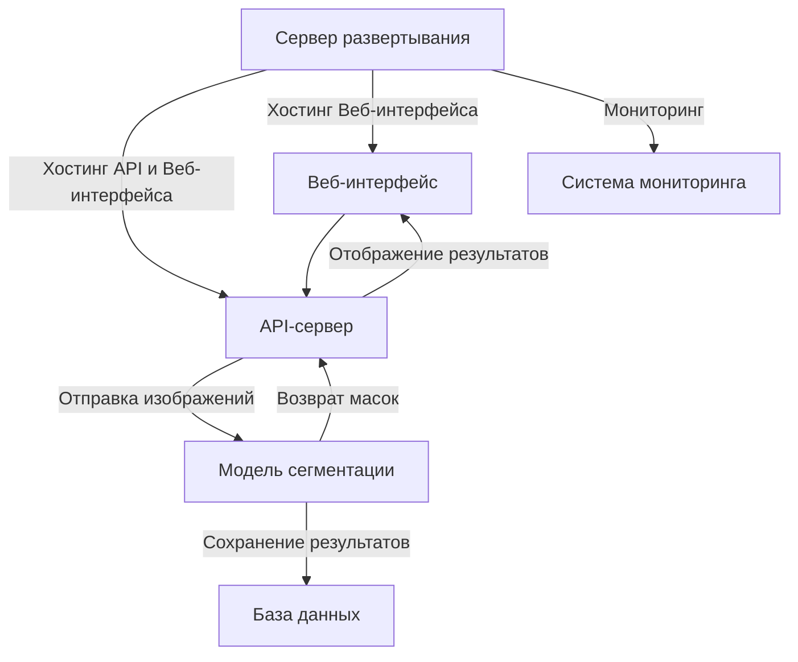
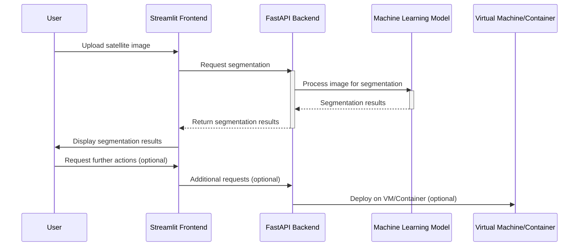

# ML System Design Doc
## Дизайн ML системы - RaisonText MVP

### 1. Цели и предпосылки
#### 1.1. Зачем идем в разработку продукта?

- Бизнес-цель:
  - Разработка системы для распознавания утечек и выбросов метана на газопроводах и в естественной среде с использованием спутниковых снимков. Задача заключается в предоставлении эффективного решения для обнаружения очагов газа для их дальнейшей локализации.

- Чему помогаем:
  - Работа призвана облегчить поиск метана в атмосфере Земли, чья утечка вызвана природными или техногенными факторами, обеспечивая возможность быстро и точно выявлять источники выброса метана. Тем самым снижая потери для держателей газопроводов и снижая общее присутвие метана в атмосфере, оказывающего значительное влияние на парниковый эффект.

- Что считаем успехом:
    - решение доступно всем по API или через сайт
    - решение отказоустойчиво и не падает при большой нагрузке
    - решение имеет понятную документацию по внедрению

- Расходы:
  - Работа дата-саентистов: Включает в себя оплату труда и прочие издержки, связанные с формированием и поддержанием команды дата-саентистов, занимающихся созданием и поддержкой ML-моделей для системы распознования утечек метана.
  - Инфраструктурные затраты на ML-модели: Включают расходы, связанные с необходимой инфраструктурой для развертывания и функционирования ML-моделей. Это может охватывать расходы на вычислительные ресурсы (например, серверы или облачные вычисления), хранение данных, сетевую инфраструктуру, обеспечение безопасности и т.д.

#### 1.2. Бизнес-требования и ограничения  

- Бизнес-требования:

    - код решения и данные
    - используются только публично доступные или сгенерированные данные

- Бизнес-ограничения:

    - система может принимать 1 документ за 1 запрос
    - система имеет простой Web UI с возможностью вставить 1 документ и получить изображние
    - на выходе система отдает сегментированное изображение на каждое входное изображение
    - время ответа не более 10 секунд

- Возможные пути развития проекта:

  - дообучение существующих моделей, и тюнинг гиперпараметров
  - проверка новых моделей (CogVLM, SAM и другие)
  - расширение обучающего набора данных, обогащение более качественными примерами
  - в перспективе фундоментальная модель по спутниковым снимкам

- Возможные применения проекта:

  - поиск утечек газа средне-крупных масштабов в трубопроводе
  - исследования по вегетативному индексу различных культур
  - поиск естественных выбросов метана 

#### 1.3 Типичный сценарий использования

- Компания Х, имеющая под своим управлением газопровод, использует наше решение. При выявлении факта утечек по спутникам легко будет определить координаты где находиться пробой.

### 2. Методология

#### 2.1. Постановка задачи

Задача семантической сегментации спутниковых снимков.

#### 2.2 Критерии успеха технического решения

Ответ сервера не более 10 секунд и качество ML модели на основе метрики IoU (Intersection over Union) и AP (Average Precision) > 75%

IoU - это метрика, которая измеряет сходство между сегментированной маской и эталонной маской для объекта. Эта метрика широко используется для оценки качества сегментации.

Вот как вычислить IoU:

- Получим сегментированную маску (маску, предсказанную нашей моделью) и эталонную маску для одного изображения.

- Вычислим пересечение между сегментированной маской и эталонной маской. Пересечение можно получить путем побитового "и" (логического "и") двух масок.

- Вычислим объединение сегментированной маски и эталонной маски. Объединение можно получить путем побитового "или" (логического "или") двух масок.

- Рассчитаем IoU, разделив площадь пересечения на площадь объединения:

  - IoU = Площадь пересечения / Площадь объединения

- Интерпретация IoU:
  - Значение IoU будет лежать в диапазоне от 0 до 1, где 0 означает полное непересечение масок, а 1 означает, что маски идентичны.

AP - это метрика, которая оценивает точность модели при разных порогах бинаризации для задачи сегментации.

Вот как вычислить AP:

- Сначала, для каждого изображения, вычислим Precision и Recall при разных порогах бинаризации. Порог бинаризации позволяет задать, какие пиксели считаются положительными и какие отрицательными.

- Построим кривую Precision-Recall (PR-кривую), где Recall будет по оси X, а Precision - по оси Y. Эта кривая показывает, как меняется точность модели в зависимости от Recall при разных порогах бинаризации.

- Вычислим площадь под PR-кривой (AUC-PR). Это можно сделать, используя различные методы, такие как метод трапеции или интерполяция. Эта площадь будет отображать среднюю точность модели при различных порогах.

- Average Precision (AP) будет средним значением AUC-PR для всех изображений в наборе данных:
  - AP = Среднее значение AUC-PR для всех изображений

- Интерпретация AP:
  - Чем выше значение AP, тем лучше модель справляется с задачей сегментации при разных порогах бинаризации.

#### 2.3. Диаграмма архитектуры решения задачи

#### 2.4. Этапы решения задачи

**Этап 0. Изучение предметной области**

Задачи:
- Анализ доступных технологий и алгоритмов сегментации изображений, применимых для поиска метана.
- Сравнение эффективности различных методов с точки зрения точности, скорости и стоимости.

Риски и вызовы:
- Риск использования устаревших или неэффективных методов из-за быстро развивающегося характера технологий.
- Сложности в получении достоверных данных для проверки метода из-за ограничений доступа к данным высокого разрешения.

Выход:
- Отчет о сравнении и анализе различных методов детекции метана, включающий преимущества и недостатки каждого из них.
- Рекомендации по выбору метода для реализации в проекте, основанные на данных исследований и консультаций с экспертами.
- План дальнейших действий для валидации и тестирования выбранного метода.

**Этап 1. Подготовка данных**

Задачи:
- Сбор и подготовка спутниковых снимков с вегетативным индексом растительности.
- Создание эталонных масок для утечек метана на основе снимков.
- Разметка данных для обучения модели.

Риски и вызовы:
- Трудности в создании точных эталонных масок для утечек метана на снимках.
- Обеспечение разнообразия данных и баланса классов.

Выход:
- Набор спутниковых снимков с масками утечек метана.
- Набор данных для обучения модели.
- Оценка качества и характера данных.

**Этап 2. Построение Baseline ML модели**

Задачи:
- Разработка пайплайна для обработки и представления спутниковых снимков.
- Применение базовых методов сегментации, например, сегментации порогом.
- Оценка и выбор подходящей архитектуры модели для задачи сегментации.

Риски и вызовы:
- Выбор оптимальной архитектуры модели для сегментации.
- Обеспечение высокой точности сегментации.

Выход:
- Пайплайн для обработки и сегментации спутниковых снимков.
- Модель для сегментации утечек метана.
- Оценка качества модели.

**Этап 3. Построение дополнительных моделей (optional)**

Задачи:
- Оценка и эксперименты с разными архитектурами и методами сегментации.
- Ансамблирование моделей.

Риски и вызовы:
- Доступные вычислительные ресурсы и время на эксперименты.

Выход:
- Документация по проведенным экспериментам и выбранной архитектуре.

**Этап 4. Развертывание**

Задачи:
- Разработка API для сегментации спутниковых снимков.
- Развертывание системы на сервере.
- Отладка и мониторинг.

Риски и вызовы:
- Проблемы с производительностью на сервере при обработке больших снимков.

Выход:
- API для сегментации спутниковых снимков.
- Документация и примеры использования.

**Этап 5. Разработка web интерфейса (optional)**

Задачи:
- Создание веб-страницы с интерфейсом для загрузки и сегментации спутниковых снимков.

Выход:
- Работающий веб-интерфейс.

**Этап 6. Тестирование и отладка**

Задачи:
- Тестирование системы, включая обработку ошибок и сценарии отказа.

Выход:
- Исправления и улучшения системы на основе результатов тестирования.

**Этап 7. Создание финального отчета**

Задачи:
- Подготовка презентации проекта.

Выход:
- Презентация проекта с описанием решения и результатов.

#### 2.5. Данные для задачи

Были использованы публичные датасеты:

- [National Centers for Environmental Information](https://www.ncei.noaa.gov/products/climate-data-records/normalized-difference-vegetation-index)
- [MODIS](https://modis.gsfc.nasa.gov/data/dataprod/mod13.php)
- [EARTHDATA](https://www.earthdata.nasa.gov/news/impact-ibm-hls-foundation-model)

### 3. Внедрение
#### 3.1. Архитектура решения

#### 3.2. Описание инфраструктуры и масштабируемости

Проект по сегментации спутниковых снимков для обнаружения утечек метана базируется на совместном использовании Streamlit для фронтенда и FastAPI для бэкенда.

- **Streamlit** предоставляет интерфейс для пользователей, позволяя им загружать спутниковые изображения и визуализировать результаты сегментации. Streamlit был выбран за его способность быстро создавать интерактивные веб-приложения, что позволяет исследователям и инженерам сосредоточиться на аналитике данных, а не на деталях реализации веб-интерфейса.

- **FastAPI** работает как серверная часть, обрабатывая запросы от Streamlit, запуская процесс сегментации с помощью машинного обучения и возвращая результаты. FastAPI обеспечивает высокую производительность, асинхронную обработку запросов и легко интегрируется с системами машинного обучения благодаря своей совместимости с Pydantic и Starlette.

Система может быть развернута на виртуальных машинах или в контейнерах, используя такие сервисы, как Docker, для обеспечения изоляции зависимостей и упрощения процесса развертывания.

- **Горизонтальное масштабирование**: Система поддерживает горизонтальное масштабирование путем добавления дополнительных экземпляров серверов FastAPI, что позволяет эффективно обрабатывать растущий поток запросов. 

- **Асинхронная архитектура**: FastAPI асинхронно обрабатывает запросы, что позволяет эффективно использовать ресурсы сервера и обслуживать множество запросов параллельно, не блокируя операции ввода/вывода.

- **Кэширование и оптимизация**: Результаты обработки изображений, которые не требуют реального времени, могут быть закэшированы для повторного использования, что снижает нагрузку на систему и ускоряет отдачу результатов пользователям.

#### 3.3. Технические требования

**Минимальный состав аппаратных средств**

Технические средства должны включать в себя следующие программные и аппаратные составляющие:

- персональный компьютер с операционной системой Ubuntu 20:04 и выше
- процессор с частотой не менее 3 ГГц
- GPU видеокарту серии NVIDIA GTX 1080Ti и выше
- наличие устройств ввода
- оперативную память не менее 8Гб
- жесткий диск объемом 40 Гб и выше

**Минимальный состав программных средств**

Для функционирования программы необходимы следующие программные средства:

- python версии 3.8 или выше и установленные зависимости;
- набор инструментов CUDA для Linux версии 11.3 или выше.

#### 3.4. Требования к работе системы
Пропускная способность и задержка обеспечивается структурой и возможностью масштабирования

#### 3.5. Безопасность системы
Обеспечивается отсутствием внешних связей
